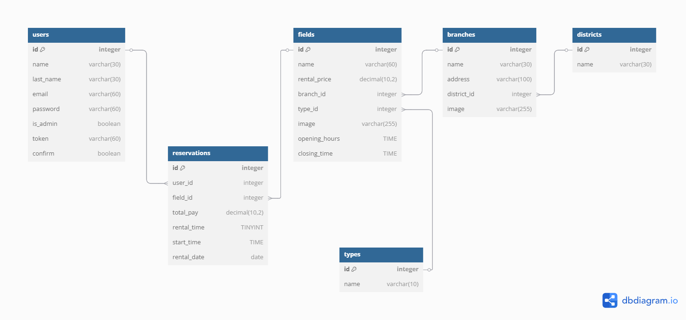

# YOUR FIELD YOUR SPACE YOUR PASSION

## Listado de Entidades

### users **(ED)**

- id **(PK)** integer
- name varchar(30)
- last_name varchar(30)
- email **(UQ)** varchar(60)
- password varchar(60)
- is_admin boolean
- token varchar(60)
- confirm boolean

### districts **(ED | EC)**

- id **(PK)** integer
- name varchar(30)

### branches **(ED | EC)**

- id **(PK)** integer
- name varchar(30)
- address varchar(100)
- district_id **(FK)** integer
- image varchar

### types **(EC)**

- id **(PK)** integer
- name varchar(10)

### fields **(ED | EC)**

- id **(PK)** integer
- name varchar(60)
- rental_price DECIMAL(10,2)
- branch_id **(FK)** integer
- type_id **(FK)** integer
- image varchar
- opening_hours TIME
- closing_time TIME

### reservations **(ED)**

- id **(PK)** integer
- user_id **(FK)** integer
- field_id **(FK)** integer
- total_pay DECIMAL(10,2)
- rental_time TINYINT
- start_time TIME
- rental_date DATE

## Relaciones

1. Los **users** tienen **reservas** (_1 - M_).
1. los **campos** pertenecen a **sucursales** (_1 - M_).
1. Las **sucursales** pertenecen a **distritos** (_1 - M_).
1. Los **campos** tienen **tipos** (_1 - M_).

## Diagramas

### Modelo Relacional de la BD

## Reglas de Negocio

### users

1. Crear un user.
1. Leer todos los users.
1. Leer un user en particular.
1. Validar un user.
1. Actualizar datos del user.
1. Actualizar password de user.
1. Eliminar user.

### reservas

1. crear una reserva
1. leer todas las reservas
1. leer una reserva en particular
1. actualizar reserva
1. eliminar una reserva

### sucursal

1. crear una sucursal
1. leer todas las sucursales
1. leer una sucursal en particular
1. actualizar sucursal
1. eliminar una sucursal

### distrito

1. crear un distrito
1. leer todos los distritos
1. leer un distrito en particular
1. actualizar distrito
1. eliminar un distrito

### campos

1. crear un campo
1. leer todos los campos
1. leer un campo en particular
1. actualizar campo
1. eliminar un campo
